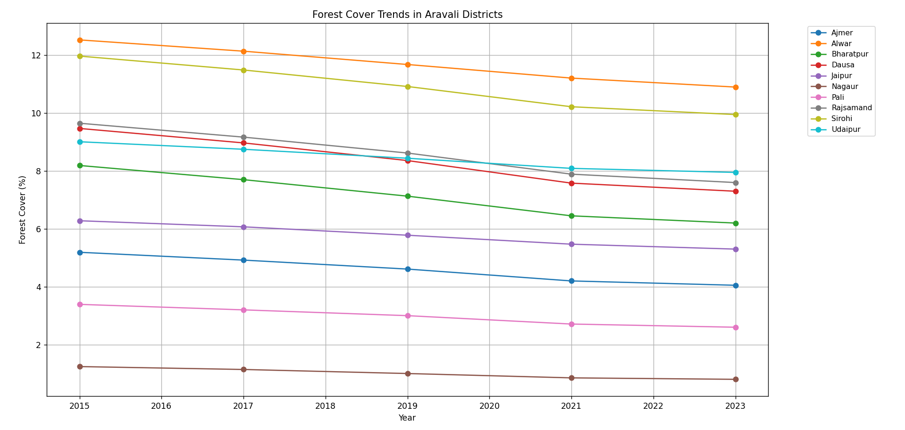

# Aravali Forest Cover Analysis (2015–2023)

A statistical analysis of forest cover trends (2015–2023) in Rajasthan’s Aravali region using Python and hypothesis testing.

I'm Rishabh, a Python learner interested in data analysis and environmental sustainability. 
This project demonstrates my ability to perform statistical analysis on real-world environmental data.

---

## What I Tried to Do

There is an ongoing discussion that forest cover in the Aravali region is continuously declining.
Instead of relying on assumptions, I analyzed official data to check whether the decline is statistically significant between 2015 and 2023.

---

## Where I Got the Data

The data is compiled from reports published by the Forest Survey of India (ISFR 2015, 2017, 2019, 2021, 2023). 
I manually reviewed the official PDF reports, extracted district-wise forest cover percentages for 10 districts in the Aravali region of Rajasthan, and structured them into a clean CSV dataset for analysis.
This helped me understand how raw government data can be transformed into an analyzable dataset.

---

## Forest Cover Trend Visualization

Below is the generated trend plot showing forest cover changes from 2015 to 2023:
<p align="center">  </p>

---

## 📊 Statistical Results

| Metric                     | Value      |
|----------------------------|-----------:|
| Districts analyzed         |       10   |
| Year range                 | 2015–2023  |
| Mean forest cover (2015)   |    7.69%   |
| Mean forest cover (2023)   |    6.47%   |
| Overall absolute change    |   -1.23%   |
| Statistical significance   | p = 0.0001 |
| Effect size (Cohen's d)    |     2.28   |

### Interpretation

- All 10 districts showed a decline in forest cover between 2015 and 2023.
- The paired t-test indicates that the decline is statistically significant (p < 0.05).
- The effect size (Cohen’s d) suggests the decline is practically large.
- The overall trend shows a consistent reduction across districts during the study period.

*Note: Exact values may vary slightly depending on rounding. Run the script to see precise output.*

---

## 🖥 Sample Output

Below is the output generated when running the analysis script:

```bash
Mean forest cover (2015): 7.69%
Mean forest cover (2023): 6.47%
Absolute change: -1.23%
Paired t-test p-value: 0.0001
Cohen's d: 2.28
```
---

## Files in This Project

- `data/aravali_forest_data.csv` – cleaned dataset compiled from ISFR reports  
- `analysis.py` – Python script for analysis and visualization  
- `requirements.txt` – list of required Python libraries  

---

## How to Run My Code

1. Install dependencies:

```bash
pip install -r requirements.txt
```

2. Run the analysis:

```bash
python analysis.py
```

---

## Tools Used

- Python 3
- pandas (data processing)  
- scipy (statistical testing)  
- matplotlib (visualization)

---

## Limitations

- The dataset contains five time points (2015–2023).
- Analysis is based on district-level aggregated data.
- More detailed spatial analysis using satellite imagery could provide deeper insights.
- Future work could include predictive modeling or time-series forecasting of forest cover trends.

---

## About Me

Rishabh Gaur 
B.Tech Student | Interested in Data Analysis & AI  
(Open to internships and research opportunities)
